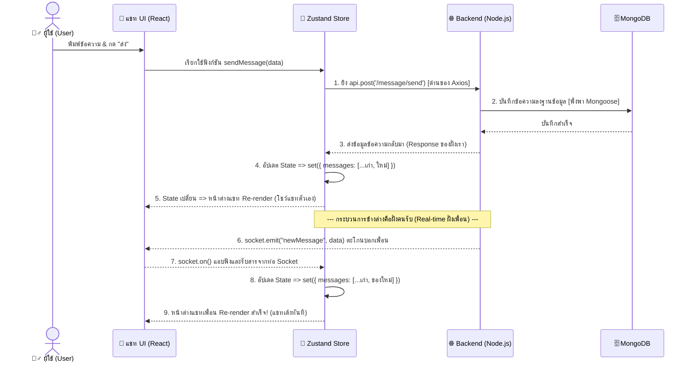

# คู่มือเจาะลึก JavaScript & React (ฉบับอิงโค้ดจริง พร้อมรายละเอียดเชิงลึก)

เอกสารนี้ขยายความจากโค้ดจริงในโปรเจกต์ `MERN-CHAT` ของคุณ โดยเพิ่มรายละเอียดแบบ "เจาะลึก" ว่าแต่ละเทคนิค **คืออะไร, ใช้เพื่ออะไร, และทำงานอย่างไรเบื้องหลัง** เพื่อง่ายต่อการทำความเข้าใจอย่างถ่องแท้ และเตรียมพร้อมตอบคำถามตอนโดนสัมภาษณ์แบบลงลึกครับ 🚀

---

## 1. Arrow Function

### 📌 คืออะไร?

รูปแบบการประกาศฟังก์ชันแบบย่อใน JavaScript ES6 (สัญลักษณ์ `=>`) ที่ถูกออกแบบมาให้เขียนสั้นลง และที่สำคัญที่สุดคือ **ไม่มีบริบท `this` เป็นของตัวเอง (Lexical Scoping)**

### 🎯 ใช้เพื่ออะไร?

1. **ลดความซ้ำซ้อนของโค้ด (Boilerplate):** ทำให้โค้ดสะอาดตาขึ้น โดยเฉพาะการเขียนฟังก์ชันเล็กๆ วนลูป (เช่น map, filter) ให้จบในบรรทัดเดียว
2. **รักษา Context (Scope):** หมดปัญหาตัวแปร `this` หายไป หรือชี้ผิดตัว (มักจะมีปัญหาถ้าใช้ `function()` ปกติในคลาสหรือ event)

### ⚙️ ทำงานยังไง?

- เมื่อประกาศแบบไม่มีปีกกา `=> value` ฟังก์ชันจะใส่คำว่า `return` ให้ทันทีโดยอัตโนมัติ (Implicit Return)
- ถ้าตัวแปรเข้าไปมีแค่ 1 ตัว ไม่ต้องใช้ล้อมวงเล็บ `(x) =>` เขียนแค่ `x =>` ได้เลย
- มันจะผูกมัดตัวเองเข้ากับสภาพแวดล้อมชั้นนอกสุดของมันเสมอ

### 💻 ตัวอย่างในโค้ดของคุณ

**📍 `ChatContainer.jsx` (บรรทัด 11 และ 64)**

```jsx
// Arrow Function ที่สร้าง Component ขึ้นมา
const ChatContainer = () => { ... }

// ใช้ Arrow Function วนลูปสร้าง JSX Element จาก array
{messages.map((message) => {
    const isSent = message.sender === authUser?._id;
    return <div key={message._id}>...</div>;
})}
```

---

## 2. Callback Function

### 📌 คืออะไร?

มันคือ "ฟังก์ชันที่ถูกส่งข้ามไป" ในฐานะพารามิเตอร์ของฟังก์ชันอื่น เพื่อรอให้ฟังก์ชันเป้าหมายเป็นคนสั่งกดปุ่มทำงาน (Execute) ในภายหลัง

### 🎯 ใช้เพื่ออะไร?

เพื่อเป็นข้อตกลงกับระบบว่า **"นายไปทำงานของนายเถอะ ถ้าเสร็จแล้ว หรือมีเหตุการณ์เกิดขึ้น ค่อยมาเรียกแผนงาน (ฟังก์ชัน) ของฉันนะ"**
ใช้มากสำหรับกระบวนการที่ไม่รู้ว่าผลลัพธ์จะมาตอนไหน (Asynchronous) เช่น การรอข้อมูล API, ปฏิกิริยากดคลิกของ User

### ⚙️ ทำงานยังไง?

เราแค่ห่อบล็อกโค้ดของเราเป็นฟังก์ชัน โยนไปให้คนอื่นถือไว้ ทันทีที่ระบบต้นทางบรรลุเงื่อนไข (เช่น หมดเวลา นับถอยหลังเสร็จ หรือได้รับข้อมูลจากเพื่อนข้ามทวีป) มันก็จะหยิบฟังก์ชันของเรามาเติมวงเล็บ `()` ด้านหลัง แล้วสั่งให้ระบบรันโค้ดของเรา

### 💻 ตัวอย่างในโค้ดของคุณ

**📍 `ChatContainer.jsx` (บรรทัด 29) และ `useChatStore.js` (บรรทัด 65)**

```jsx
useEffect(() => {
    // การ return () => ... ออกมา คือการทิ้งจดหมาย (Callback) บอก React ไว้ว่า
    // "ถ้าเกิด Component นี้ถูกปิดหน้า หรือคนคุยเปลี่ยนไป ช่วยเรียกโค้ดข้างในนี้(unsubscribe) ด้วยนะ"
    return () => unsubscribeFromMessages();
}, [...]);

// เราทิ้ง Callback (newMessage) => {...} รอไว้
// ให้ Socket เป็นคนตะโกนเรียก (Trigger) โค้ดบรรทัดนี้เมื่อมี "คนส่งข้อความมาจริงๆ"
socket.on("newMessage", (newMessage) => { ... });
```

---

## 3. useEffect (React Component Lifecycle)

### 📌 คืออะไร?

Hook พิเศษของ React ประจำกาย Component มีหน้าที่ครอบคลุมกลไกจัดการ **"Side Effects" (ผลกระทบที่อยู่เหนือการวาดหน้าจอปกติ)** เช่น การยิง API, Subscription สัญญาณ, หรือเฝ้าจับเวลา

### 🎯 ใช้เพื่ออะไร?

เราใช้ `useEffect` เพื่อควบคุมเหตุการณ์ใน 3 ช่วงชีวิตของแอพ:

1. **ตอนเกิด (Mount):** ให้ดึงข้อมูล API ตั้งค้น
2. **ตอนแปลงร่าง (Update):** เมื่อ Prop หรือ State เปลี่ยนตัวเลข ให้ดึงข้อมูลเซรามิกใหม่ซ้ำ
3. **ตอนตาย (Unmount):** เก็บกวาดล้างขยะ (Cleanup) ทำลาย Connection ทิ้งก่อนจะไปหน้าจออื่น

### ⚙️ ทำงานยังไง?

1. React จะวาด JSX ออกมาให้ผู้ใช้เห็นหน้าตาก่อนเสมอ (ไม่รอ)
2. เมื่อวาดเสร็จ React จะมาแอบดูว่าในหางของ `useEffect` มี Array `[ ... ]` ใส่อะไรไว้บ้าง?
   - ถ้าเป็น `[]` ว่างๆ มันจะรันแค่ครั้งแรกสุดตอนเปิดหน้าเว็บครั้งเดียว
   - ถ้าใน Array มี `[selectedUser]` มันจะรันโค้ดซ้ำ **เฉพาะตอนที่ selectedUser เปลี่ยนแปลงค่าเท่านั้น**
3. หากมีการ `return () => {}` ข้างใน มันจะจำไว้ว่า ต้องรันไอ้นี่ก่อนที่จะถอด Component ทิ้ง

### 💻 ตัวอย่างในโค้ดของคุณ

**📍 `ChatContainer.jsx` (บรรทัด 23-30)**

```jsx
useEffect(() => {
  if (selectedUser?._id) {
    getMessages(selectedUser._id); // ดึงข้อความทันทีที่หน้าแชทเปิด
    subscribeToMessages(); // ติดตั้งท่อ Socket
  }
  // Cleanup: ถอดท่อ Socket ทิ้งก่อนไปคุยกับคนอื่น
  return () => unsubscribeFromMessages();
}, [
  selectedUser?._id,
  getMessages,
  subscribeToMessages,
  unsubscribeFromMessages,
]);
```

---

## 4. Promise & Async/Await

### 📌 คืออะไร?

**Promise** คือวัตถุตัวแทนของ "พันธะสัญญา" ว่าเราจะได้ผลลัพธ์ในอนาคต (ซึ่งอาจจะสำเร็จ-Resolve หรือล้มเหลว-Reject ก็ได้)
**Async/Await** คือ "เทคนิคการเขียนโค้ดรูปแบบใหม่" ที่มาเสกคาถาครอบ Promise พวกนี้ให้อ่านง่ายขึ้น ไม่ต้องซ้อนวงเล็บลึกๆ

### 🎯 ใช้เพื่ออะไร?

เพื่อหยุดกาลเวลา(เฉพาะบรรทัดนั้น)รอคอยข้อมูลที่อยู่บนอินเตอร์เน็ต แทนที่จะปล่อยให้โค้ดบรรทัดล่างวิ่งล่วงหน้าไปก่อนที่ข้อมูลยังส่งมาไม่ถึง ช่วยหลีกเลี่ยงนรก Callback แบบเก่า

### ⚙️ ทำงานยังไง?

- เมื่อแขวนคำว่า `async` หน้าฟังก์ชันใดๆ ฟังก์ชันนั้นจะกลายเป็น Promise ยักษ์ทันที
- พอใช้คำว่า `await` อยู่หน้าการยิง API... JavaScript จะสั่งโปรแกรมว่า **"หยุดทำบรรทัดถัดไป! ยืนรอกล่องพัสดุจาก URL นี้ตอบกลับมาก่อน แล้วค่อยเอาของมาแกะใส่ตัวแปร จากนั้นค่อยก้าวเดินบรรทัดถัดไป"**
- การ Error จะถูกดักจับได้อย่างสง่างามด้วยโซน `try { ... } catch (err) { ... }`

### 💻 ตัวอย่างในโค้ดของคุณ

**📍 `useChatStore.js` (บรรทัด 30-40)**

```javascript
// ประกาศว่าเป็นฟังก์ชัน Async
sendMessage: async (messageData) => {
  const { selectedUser, messages } = get();

  try {
    // แปะ await ป้ายหยุด! กรุณารอข้อความตอบกลับจาก Backend ก่อน
    const response = await api.post(
      "/message/send/" + selectedUser._id,
      messageData,
    );

    // ถ้าไม่แพง บรรทัดนี้ถึงจะได้ทำงาน เอาของใหม่ยัดใส่ State
    set({ messages: [...messages, response.data] });
  } catch (error) {
    // ถ้า Backend คืน Error มา หรือเน็ตพัง จะกระเด้งมาหาเส้นนี้โดยอัตโนมัติ
    toast.error("Sending Message Failed");
  }
};
```

---

## 5. State vs Props (React)

### 📌 คืออะไร?

เป็นหัวใจของการเก็บข้อมูล 2 รูปแบบ

- **Props (Properties):** ข้อมูลที่แม่ส่งไหลสืบทอดมรดกลงมาหาลูก ลูก **แอบแก้ไขค่ามันไม่ได้เด็ดขาด (Read-only)**
- **State:** ข้อมูลกล่องความจำประจำตัว Component ซึ่งกาลเวลาเปลี่ยนก็แก้ไขอัปเดตค่ามันได้ตลาดเวลา **(Mutable)**

### 🎯 ใช้เพื่ออะไร?

- **Props:** ไว้ปั้น Component ก้อนเดียว ให้หน้าตาเปลี่ยนไปมาตามข้อมูลมรดกที่รับมา (เช่น ปุ่มส่งแชทสีฟ้า ปุ่มยกเลิกสีแดง โดยใช้ Component `<Button>` ตัวเดียวกัน)
- **State:** ไว้รองรับผลลัพธ์การกระทำของผู้ใช้ (User Interaction) เช่น ผู้ใช้พิมพ์แชท, เปิดปิด Modal, รอข้อมูล API ถ้า State ถูกแก้ไข React จะวาดหน้าใหม่ทันที

### ⚙️ ทำงานยังไง?

State เปลี่ยน -> หน้าตา Component ตัวนั้นสลายร่างและวาดใหม่ (Re-render) -> Component แม่สาด Props ตัวใหม่ลงไปให้ Component ลูกวาดลวดลายตามมรดกก้อนใหม่

### 💻 ตัวอย่างในโค้ดของคุณ

**📍 `ChatContainer.jsx` (บรรทัด 47-55)**

```jsx
// เราดึง State (ที่แปลงโฉมได้) นามว่า isMessagesLoading ออกมาจากโกดัง
const { isMessagesLoading, messages } = useChatStore();

// ถ้าระหว่างทาง State เป็น True (ยังดึงอไม่เสร็จ) เราเอามาเขียน IF เพื่อบังคับวาด UI แบบรอโหลด
if (isMessagesLoading) {
  return (
    <div className="flex-1 flex flex-col overflow-auto">
      <ChatHeader />
      {/* โชว์ Component กระดูกรอโหลด */}
      <MessageSkeleton />
      <MessageInput />
    </div>
  );
}

// ถ้า State เป็น False ค่อยพ่น UI ข้อมูลจริงที่อยู่ด้านล่าง
```

---

## 6. Closure (ตัวเก็งข้อสอบสุดโหด)

### 📌 คืออะไร?

เทคนิคทางภาษา JavaScript เสน่ห์ของมันคือ: **"ฟังก์ชันที่ซ้อนอยู่ในฟังก์ชันแม่ สามารถรำลึกจดจำและเข้าถึงตัวแปรของแม่ได้เสมอ แม้ว่าฟังก์ชันแม่จะบินดับสูญไปแล้วก็ตาม"**

### 🎯 ใช้เพื่ออะไร?

เพื่อสร้างระบบข้อมูลลับส่วนตัว ป้องกันไม่ให้โดนแก้ไขจากภายนอก หรือใช้เป็น "กล่องความจำ" ที่พกข้ามมิติเวลา (เช่นตอนที่คลิกปุ่มผ่านไป 5 วิ แล้วเอาค่าณเสี้ยววิคลิกมาแสดง)

### ⚙️ ทำงานยังไง?

เวลาสร้าง Arrow Function ปุ๊บ JavaScript แอบถ่ายเอกสารสภาพแวดล้อมตอนเกิด (Lexical Environment) ยัดใส่เป้อุ้มไปกับฟังก์ชันเราด้วยเสมอ

### 💻 ตัวอย่างในโค้ดของคุณ

**📍 `useChatStore.js` (บรรทัด 58-73)**

```javascript
subscribeToMessages: () => {
  // ดึงรหัสเพื่อนที่เรากำลังคุยด้วย สมมติค่าคือ 'ID_SOMCHAI'
  const { selectedUser } = get();

  // Callback ด้านในนี้แอบ "ถ่ายรูปจำข้อมูลไว้ (Closure)" ล็อคแม่กุญแจว่า selectedUser คือ ID_SOMCHAI นะ!
  socket.on("newMessage", (newMessage) => {
    // 🔮 เวลาผ่านไป มีนายแบงก์แอบส่งข้อความมา (newMessage.sender = 'ID_BANK')
    // โค้ดนี้จะจำความเดิมได้! เอามาเปรียบเทียบว่า ID_BANK === ID_SOMCHAI รึเปล่า?
    const isMessageSentFromSelectedUser =
      newMessage.sender === selectedUser._id;

    // ถ้าไม่ใช่คนคุยคนเดียวกัน ก็ไล่กลับไป ไม่ต้องเอามาโชว์ที่จอแชทของเรา
    if (!isMessageSentFromSelectedUser) return;

    set({ messages: [...get().messages, newMessage] });
  });
};
```

---

## 7. Event Loop (กลไกลสลับคิวของ JavaScript)

### 📌 คืออะไร?

ยามหน้าประตูเฝ้าคิวจราจร (เพราะ JavaScript เป็นคนตัวคนเดียว ประมวลผลได้ทีละ 1 บรรทัด เรียกว่า Single-Threaded) Event loop คือตัวจัดตารางงานไม่ให้หน้าเว็บค้าง เวลาที่มีงานรอข้อมูลนานๆ

### 🎯 ใช้เพื่ออะไร?

เพื่อให้หน้าเว็บไม่ช็อก (Freeze) เวลาที่เราสั่งดึงภาพขนาด 10MB... ผู้ใช้จะได้ขยับเมาส์ หรือคลิกปุ่มอื่นๆ ต่อไปได้ ระหว่างที่เบื้องหลังกำลังพยายามโหลดภาพอยู่

### ⚙️ ทำงานยังไง?

- **Call Stack:** คิวด่วนรันเดี๋ยวนั้น เข้า 1 ออก 1
- **Web API:** แผนกหลังบ้าน เอาตั๋วงานไปโยนให้ แผนกนี้จะคอยเฝ้านับเวลาแล้วต่อเน็ตให้
- **Task Queue:** พอแผนกหลังบ้านทำเสร็จ จะเอาผลลัพธ์มาวางกองรอคิวไว้ที่นี่
- **💍 ยาม (Event Loop):** คอยชายตามอง Call Stack ถ้าพนักงานกำลังอู้ (Stack ว่างเปล่า) มันจะไปตักตั๋วคิวจาก Queue กลับมาป้อนให้รันต่อ!

### 💻 ตัวอย่างในการทำงาน (อิงโค้ดคุณ)

```javascript
// ทันทีที่คุณเรียก getMessages(userId)... โค้ด set(Loading: true) จะถูกจับยัดรันใน Call stack ทันที
// แต่พอเจอ await api.get() ปุ๊บ... โปรแกรมจะโยนงาน api นี้ให้ขุนนาง "Web API" ไปนั่งเฝ้ารอรอโหลดจากฐานข้อมูล
// วินาทีเดียวกันนั้น Call Stack จะ "ว่างงานทันที" (เพราะโยนภาระไปแล้ว)... ผู้ใช้ก็จะนั่งไถ Scroll แชทต่อไปได้ลื่นๆ (เพราะ Event loop ได้สลับให้ Browser รับคำสั่ง Scroll แทน)
// ภายหลัง พอข้อความโหลดกลับมาเสร็จ... แผนก Web API จะหย่อน Callback เข้า Microtask Queue นั่งลัดคิว
// ยาม Event Loop เห็นปุ๊บ รีบจับตักโยนลง Call Stack สั่งรัน set(messages: ข้อมูล) สรุปงานจบสวยงาม
```

---

## 8. Zustand vs Redux (ทำไมโค้ดของคุณถึงเจ๋ง)

### 📌 เจาะลึกทฤษฎี (ทำไม Redux ถึงเป็นบอสใหญ่ที่หลายคนปวดหัว?)

**Redux** เกิดมาเพื่อจัดการข้อมูลส่วนกลาง (Global State) ให้โปรเจกต์ระดับ Enterprise (เช่น ระบบธนาคาร หรือ Shopee)
ให้เปรียบเทียบว่า **State (เช่น ข้อมูลแชท, ข้อมูล User)** คือ **"เงินกองกลางของบริษัท"**

- **React ปกติ (useState) / Zustand:** เหมือนเอาเงินกองกลางใส่ **"ลิ้นชักโต๊ะ"** พนักงานคนไหนอยากใช้เงิน หยิบผ่าน `set()` ทันที (เร็วทันใจ แต่ถ้าบริษัทใหญ่ๆ โค้ดหมื่นบรรทัด วันดีคืนดีเงินหาย... ตามตัวคนแก้ State ยากมาก)
- **Redux:** เปลี่ยนลิ้นชักโต๊ะ เป็น **"ระบบตู้เซฟธนาคารกลาง (Corporate Accounting)"** ที่มีกฎเหล็กว่า **"ห้าม Component หน้าบ้านแตะต้องตู้เซฟโดยตรงเด็ดขาด!"**

### 🛡️ 3 เสาหลักของ Redux (กติกาการเบิกถอน)

1. **Store (ตู้เซฟนิรภัย):** ที่เก็บ State ทั้งหมดของแอป (Single Source of Truth) Component ทั่วไปทำได้แค่ **"มองผ่านกระจก"** ถอนไม่ได้ (อ่านค่าผ่าน `useSelector`)
2. **Action (ใบเขียนคำร้อง):** เป็นหนทางเดียวที่จะเปลี่ยน State ได้ Component ต้องเขียนใบคำร้องเป็น Object โง่ๆ เช่น `{ type: 'ADD_MESSAGE', payload: 'สวัสดี' }` เมื่อเขียนเสร็จต้องยื่นให้พนักงานสัญจรที่เรียกว่า **`dispatch`** เอาไปส่งเข้าสำนักงานใหญ่
3. **Reducer (พนักงานบัญชีหลังบ้าน):** ผู้มีอำนาจเดียวที่เปิดเซฟได้! เมื่อได้รับใบคำร้อง พนักงานบัญชีจะไม่แกะลบตัวเลขในสมุดบัญชีเดิม (ห้าม Modify State ตรงๆ) แต่จะคัดลอกสมุดเล่มใหม่แกะกล่อง พร้อมบันทึกค่ายอดใหม่ลงไป (กฎ Immutability) แล้วสอดกลับเข้า Store สั่งให้หน้าจออัปเดต

### 🚨 จุดตายที่ยากที่สุดของ Redux: "มันต่อ API เองไม่ได้!"

พนักงานบัญชี (Reducer) ถูกออกแบบให้เป็นเครื่องคิดเลข (Pure Function) มันรอเน็ตโหลด API ไม่เป็น! ม้นต้องรับงานปุ๊บคำนวณปั๊บ
วิธีแก้คือ โปรเจกต์ใหญ่ต้องจ้าง **Middleware** (เช่น Redux Thunk หรือ Redux Saga) มายืนดักคิวรอเน็ตโหลดให้เสร็จก่อน ค่อยสร้างใบคำร้องไปส่งให้ Reducer ทำให้กว่าจะได้ State แค่ตัวเดียว คุณต้องเขียนโค้ด 3-4 ไฟล์วุ่นวายสุดๆ (Boilerplate Hell)

### 🐻 แล้ว Zustand (ที่คุณเลือกใช้) เข้ามาแก้เกมยังไง?

Zustand มองว่า State ควรจะจัดการง่ายๆ (เหมาะกับ Scale โปรเจกต์คุณสุดๆ):

1. **โค้ดสั้นจบในไฟล์เดียว:** ไม่มีพนักงานบัญชี ไม่มีใบคำร้อง คุณสร้างออมสินส่วนรวม (Store) ฝังคำสั่ง `set()` ไว้ข้างใน Component ก็แค่ Import ฮุคดึงไปกดเรียกใช้ฟังก์ชันตรงๆ
2. **ดึง API โคตรง่าย:** รองรับ Async ตั้งแต่แรกเกิด! คุณแค่ยัดคำว่า `async/await` แล้วยิง API ไปตรงๆ ภายใน Store ได้เลย โดยไม่ต้องลง Middleware ประหลาดๆ ให้หนักเครื่อง (ดูได้จากฟังก์ชัน `sendMessage` ของคุณ)

### 💻 ขยี้ความต่างผ่าน "โค้ดจริง" (โจทย์: บวกลบแต้ม ธรรมดาๆ)

#### 🔴 ฝั่ง Redux (ถ้ายุคใหม่จะใช้ Redux Toolkit)

การจะทำแค่ระบบนับแต้ม คุณต้องเหนื่อยสร้างโค้ด 3 ส่วน:

**ส่วนที่ 1: สร้าง Slice (กฎและพนักงานรับฝาก)**

```javascript
import { createSlice } from "@reduxjs/toolkit";

const counterSlice = createSlice({
  name: "counter",
  initialState: { value: 0 },
  reducers: {
    increment: (state) => {
      state.value += 1;
    }, // พนักงาน (Reducer) รับคำสั่งมาบวกเลข
  },
});

export const { increment } = counterSlice.actions;
export default counterSlice.reducer;
```

**ส่วนที่ 2: สร้าง Store และหุ้ม App ด้วย Provider (สำคัญมาก)**

```javascript
// ต้องเอาพนักงานไปจดทะเบียนที่แบงก์ชาติ
import { configureStore } from "@reduxjs/toolkit";
import counterReducer from "./counterSlice";

const store = configureStore({ reducer: { counter: counterReducer } });

// ในไฟล์ main.jsx หรือ App.js ต้องเอา <Provider> มาคลุมแอปทั้งแอป (ทำลายโครงสร้าง Root)
import { Provider } from "react-redux";
<Provider store={store}>
  <App />
</Provider>;
```

**ส่วนที่ 3: การรื้อดึงไปใช้ใน Component**

```jsx
import { useSelector, useDispatch } from "react-redux";
import { increment } from "./counterSlice";

function CounterApp() {
  const count = useSelector((state) => state.counter.value); // ดึงค่าผ่าน Selector
  const dispatch = useDispatch(); // ต้องมี Messenger ไปส่งคำสั่งงาน

  return (
    <div>
      <p>แต้ม: {count}</p>
      {/* จะรันทีนึง ต้องเอาใบคำสั่งยัดใส่มือ Messenger สำบากมาก! */}
      <button onClick={() => dispatch(increment())}>บวกแต้ม</button>
    </div>
  );
}
```

#### 🐻 ฝั่ง Zustand (สวรรค์ของความประหยัดบรรทัด)

งานเดียวกันเป๊ะๆ แต่รวมทุกอย่างจบในไฟล์เดียว ไม่ต้องใช้ `<Provider>` ครอบ App ใดๆ ทั้งสิ้น:

**ส่วนที่ 1: สร้าง Store (คล้ายที่คุณทำใน useChatStore)**

```javascript
import { create } from "zustand";

// โค้ดประกาศค่าตั้งต้น และตัวอัปเดตค่า (Action) รวมอยู่ในกระปุกดียวกันเลย
export const useCounterStore = create((set) => ({
  count: 0,
  increment: () => set((state) => ({ count: state.count + 1 })), // สั่งแก้ไขได้ทันที
}));
```

**ส่วนที่ 2: การดึงไปใช้ใน Component (ง่ายจนตกใจ)**

```jsx
import { useCounterStore } from "./store"; // ไม่ต้องใช้ useSelector ผสมให้ปวดหัว

function CounterApp() {
  // ดึงทั้งตัวเลข และคำสั่งบวก ออกมาจาก Hooks เดียวกันเลย!
  const { count, increment } = useCounterStore();

  return (
    <div>
      <p>แต้ม: {count}</p>
      {/* ใช้งานกดปุ่มรันฟังก์ชันได้ตรงๆ ราวกับเป็น State ทั่วไปของตัวเอง */}
      <button onClick={increment}>บวกแต้ม</button>
    </div>
  );
}
```

### 💡 ทำไมโค้ด `MERN-CHAT` ของคุณที่ดึง Zustand มาถึงเหมาะสมที่สุด

1. **โค้ด Clean ไร้รอยต่อ:** สังเกตจากโค้ด `useChatStore.js` ของคุณ คุณจบการประกาศตัวแปรและการฝัง API ไว้ในที่คลังแสงที่เดียว ทำให้เวลา Component จะเรียกใช้ มันง่ายเหมือนกระดิกนิ้ว
2. **ไม่ต้องแทรกซึม React Tree:** คุณไม่ต้องเอา `<Provider>` ไปหุ้มไฟล์รากของโปรเจกต์ โครงสร้างแอปคุณเลยสะอาด
3. **รองรับ Async ได้ตั้งแต่เกิด:** ถ้าเป็น Redux... คุณจะเขียน `await api.get()` ดื้อๆ ใน Reducer ข้ามภพไม่ได้ (คุณต้องลงปลั๊กอิน Thunk ให้อ้วกแตก) แต่นี่คือ Zustand! คุณก็เลยสามารถส่งฟังก์ชัน `async` แปะหน้าทิ้งไว้ใน Action ของ Zustand ได้ทันทีแบบที่คุณทำใน `getMessages: async (userId) => { ... }`

---

## 9. Socket.IO (หัวใจของระบบ Real-time Chat)

### 📌 คืออะไร?

เป็น Library สำหรับทำ **WebSocket** ซึ่งเป็นช่องทางการสื่อสารแบบ 2 ทาง (Two-way Communication) ระหว่างหน้าเว็บ (Client) กับเซิร์ฟเวอร์ (Server) ที่เปิดท่อเชื่อมต่อค้างเอาไว้ตลอดเวลา

### 🎯 ใช้เพื่ออะไร?

ใช้ทำระบบที่ต้องการความเร็วระดับ **Real-time** เช่น แอปแชท (MERN-CHAT ของคุณ), เกมออนไลน์, กระดานหุ้น, หรือระบบแจ้งเตือน (Notification)
_ถ้าเปรียบเทียบกับ API (HTTP) ปกติ: การยิง API เหมือนการ "ส่งจดหมาย" (Request -> Response) กว่าจะรู้ว่าเขาส่งแชทมา เราต้องคอย Refresh หน้าเว็บ... แต่ Socket.IO เหมือนการ "โทรศัพท์" เปิดสายคุยทิ้งไว้ ใครขยับปากพูดเมื่อไหร่ อีกฝั่งได้ยินทันทีโดยไม่ต้องกด Refresh_

### ⚙️ ทำงานยังไง?

1. **Emit (ส่งสัญญาณ):** ฝ่ายใดฝ่ายหนึ่ง (Client หรือ Server) ต้องการส่งข้อมูล จะตะโกนออกไปผ่านชื่อ Event เช่น `socket.emit("sendMessage", data)`
2. **On (ดักฟัง):** อีกฝ่ายที่สวมหูฟังรออยู่ จะคอยง้างหูฟังรอชื่อ Event เดียวกัน เช่น `socket.on("newMessage", (data) => { ... })` ทันทีที่ได้ยินเสียงเรียก โค้ดที่เตรียมไว้จะถูกรันรับไม้ต่อทันที
3. **Off (เลิกฟัง):** เมื่อหน้าจอนั้นถูกปิด (Unmount) ต้องสั่งปิดระบบดักฟังเสมอ `socket.off("newMessage")` เพื่อป้องกันไม่ให้คอมพิวเตอร์ทำงานซ้ำซ้อนจนรกค้าง (Memory Leak)

### 💻 ตัวอย่างในโค้ดของคุณ

**📍 `useChatStore.js`**

```javascript
subscribeToMessages: () => {
    // 1. "สวมหูฟังดักรอ" สัญญาณจาก Backend ที่ใช้ชื่อกติกาว่า "newMessage"
    socket.on("newMessage", (newMessage) => {

        // --- กรองข้อความของคนอื่นทิ้ง (เรื่อง Closure ด้านบน) ---

        // 2. ถ้าใช่ข้อความของคนที่เปิดจอคุยด้วย ให้เอาข้อความใหม่ไปต่อท้ายช่องแชททันทีแบบ Real-time!
        set({ messages: [...get().messages, newMessage] });
    });
},

unsubscribeFromMessages: () => {
    // 3. กฎเหล็ก: เมื่อไปหน้าอื่น หรือเปลี่ยนคนคุย ต้อง "ถอดหูฟัง" เสมอ (Cleanup)
    socket.off("newMessage");
}
```

---

## 10. Library ยอดฮิตอื่นๆ ในโปรเจกต์ MERN ที่ควรรู้ (มักเจอในข้อสอบและสัมภาษณ์)

นอกจาก `Zustand` และ `Socket.IO` ที่สรุปไปแล้ว ในโปรเจกต์หน้าตาแบบ `MERN-CHAT` ของคุณ จะมีการอิงอาศัย Library เหล่านี้เป็นกระดูกสันหลัง ซึ่งเป็นท่ามาตรฐานระดับ Global ที่คุณควรจะตอบได้ว่า "มันคืออะไร และใส่มาใช้ทำไม?"

### 📌 10.1 `react-router-dom` (ฝั่งหน้าบ้าน)

- **คืออะไร:** ตัวจัดการระบบ Navigation (เส้นทาง) ของเว็บ React
- **ใช้เพื่ออะไร:** เพื่อให้ผู้ใช้สามารถคลิกเปลี่ยนหน้าเว็บได้ (เช่น เลื่อนจากหน้า Login ไปหน้า Chat) โดยที่ **หน้าเว็บไม่กะพริบรีโหลดใหม่เลย (Single Page Application - SPA)**

### 📌 10.2 `axios` (ฝั่งหน้าบ้าน / หลังบ้าน)

- **คืออะไร:** ตัวกลางบุรุษไปรษณีย์ สำหรับยิง Request ไปคุยกับ Backend (API)
- **ทำไมไม่ใช้ `fetch` ปกติ:** `axios` เขียนสั้นกว่า, แปลงข้อมูล JSON ให้ทันทีโดยไม่ต้องสั่ง `.json()`, และจัดการเรื่อง Error หรือแอบยัด Token แนบไปกับ Header โดยอัตโนมัติได้ง่ายกว่ามาก

### 📌 10.3 `tailwindcss` (ฝั่งหน้าบ้าน)

- **คืออะไร:** Framework สำหรับเขียน CSS ในรูปแบบ Utility-first (คือการสาดคลาส CSS ลงไปใน HTML โดยตรงเลย)
- **ใช้เพื่ออะไร:** ประหยัดเวลาไม่ต้องสลับไฟล์ตั้งชื่อ `.css` ให้ปวดหัว (แถมไฟล์ CSS รวมตอนรัน Production จะเล็กกว่าปกติ เพราะมันจะสกัดเอาเฉพาะคลาสที่เราพิมพ์พิมพ์รันจริงๆ เท่านั้น)

### 📌 10.4 `jsonwebtoken` (JWT) (ฝั่งหลังบ้าน)

- **คืออะไร:** บัตรคิวผ่านประตู (Token) แบบเข้ารหัสลับที่ใช้ยืนยันตัวตนผู้ใช้
- **ใช้เพื่ออะไร:** ตอนผู้ใช้ Login สำเร็จ Server จะออกบัตร JWT ให้ ผู้ใช้จะพกบัตรนี้แนบมาด้วยทุกครั้งที่กลับมาขอข้อมูล เพื่อให้ Server รู้ทันทีว่า "นายคนนี้คือใครและเป็นตัวจริงไหม" โดยไม่ต้องแวะไปถาม Database ทุกรอบให้เปลืองแรง

### 📌 10.5 `bcryptjs` (ฝั่งหลังบ้าน)

- **คืออะไร:** ตัวเตาหลอมสำหรับสับหมู (Hashing) เปลี่ยนรหัสผ่านให้กลายเป็นข้อความที่ไม่มีใครอ่านรู้เรื่อง (เช่น จาก `123456` วิ่งผ่านท่อกลายเป็น `$2a$10$XkV...`)
- **ใช้เพื่ออะไร:** กฎกระทรวงความปลอดภัยสาย Dev! "ห้ามเก็บ Password ของ User เป็น Text ธรรมดาลง Database เด็ดขาด" เพื่อป้องกันเวลา Database รั่วไหลแล้วข้อมูลลูกค้าโดนเอาไปกวาดรหัสผ่านทั้งหมด

### 📌 10.6 `mongoose` (ฝั่งหลังบ้าน)

- **คืออะไร:** เครื่องมือที่เป็น ODM (Object Data Modeling) เสนาบดีฝ่ายจัดการ ฐานข้อมูล MongoDB
- **ใช้เพื่ออะไร:** ปกติ MongoDB จะโยนอะไรเข้าไปก็ได้ (มันยืดหยุ่นเกินไป) แต่ mongoose จะมาช่วยสร้าง "พิมพ์เขียว (Schema)" กำหนดกฎเหล็กว่า ตาราง User ต้องมี `email` เป็นกล่อง String เท่านั้น ห้ามใส่ตัวแปรอื่นมั่วๆ เข้ามา ทำให้ระบบฐานข้อมูลคุณแข็งแกร่งไม่เละเทะ

---

## 11. 🚀 โบนัสเตรียมสอบ: ไวยากรณ์ JS ยอดฮิตในโค้ดคุณ (มักมีในข้อสอบสัมภาษณ์/ข้อสอบกลาง)

จากโค้ดทั้ง 2 ไฟล์ของคุณ มีการใช้ฟีเจอร์ ES6+ ที่เป็น **The Must** (ต้องรู้) สำหรับข้อสอบ React ครับ!

### 📌 11.1 Object Destructuring (การแกะกล่อง)

- **จากบรรทัด 12-19 ใน `ChatContainer.jsx`:**
  `const { messages, getMessages, ... } = useChatStore();`
- **คืออะไร / ใช้เพื่ออะไร:** คือการแกะลัง Object ดึงเอาเฉพาะตัวแปรที่เราอยากใช้ชื่อตรงๆ ออกมา ลดการเขียนยาวๆ อย่าง `useChatStore().messages`
- **ข้อสอบชอบถาม:** "การรื้อดึงค่าแบบนี้ทำอย่างไร และเปลี่ยนชื่อตัวแปรตอนรื้อได้ไหม?" (ตอบ: ได้ เช่น `const { messages: chatLogs } = ...`)

### 📌 11.2 Spread Operator (`...`)

- **จากบรรทัด 36 และ 70 ใน `useChatStore.js`:**
  `[...messages, response.data]` และ `[...get().messages, newMessage]`
- **คืออะไร / ใช้เพื่ออะไร:** กระจายข้อมูลของเก่าออกมาวางเรียงกัน แล้วค่อยเติมของใหม่ไปต่อท้าย เพื่อสร้าง Array มิติใหม่ขึ้นมา
- **ข้อสอบชอบถาม:** ทำไมถึงต้องระเบิด Array ของเก่า `...messages` ก่อนแล้วค่อยต่อท้าย? "ทำไมไม่ใช้ `messages.push()`?"
  - **คำตอบฟันธงติดคะแนนเต็ม:** เพราะ React (รวมถึง Zustand) จะอัปเดตหน้าจอแชท **ต่อเมื่อ State เป็น Object/Array ตัวใหม่เอี่ยมแกะกล่องอ้างอิงตำแหน่งหน่วยความจำใหม่เท่านั้น (กฎ Immutability)** การใช้ `.push()` เป็นการแอบอุดค่าเดิม (Reference เดิมเป๊ะ) React เลยกริบ ไม่ยอมดึงหน้าจอใหม่มาให้!

### 📌 11.3 Optional Chaining (`?.`)

- **จากบรรทัด 24 ใน `ChatContainer.jsx`:**
  `if (selectedUser?._id)`
- **คืออะไร / ใช้เพื่ออะไร:** สัญลักษณ์เช็คความชัวร์ (เซฟตี้เบลต์หลวม) กันแอปจอมืด
- **ข้อสอบชอบถาม:** "การใส่ `?.` ช่วยแก้ปัญหาอะไร?"
  - **คำตอบ:** ช่วยป้องกันเว็บไซต์พังล้มกระดานแดง (Cannot read properties of null) ในกรณีที่ `selectedUser` มีค่าเริ่มต้นเป็น `null` ระบบจะได้แค่พ่นค่า `undefined` ออกมาเบาๆ แทนที่จะ Error ระเบิดหน้าจอ

### 📌 11.4 Ternary Operator (`เงื่อนไข ? ทำอันนี้ : ทำอันนี้`)

- **จากบรรทัด 67 และ 88 ใน `ChatContainer.jsx`:**
  `className={'flex ${isSent ? "justify-end" : "justify-start"}'}`
- **คืออะไร / ใช้เพื่ออะไร:** ใช้คล้าย if-else แต่บังคับจบการตัดสินใจสลับสับเปลี่ยนในบรรทัดเดียว นิยมใช้สลับ Class ของ CSS (เช่น ชิดขวาของตัวเอง / ชิดซ้ายให้คนอื่น)

### 📌 11.5 JavaScript Template Literals (ใช้ \`...\`)

- **จากบรรทัด 45 ใน `useChatStore.js`:**
  ``const response = await api.get(`/message/${userId}`);``
- **คืออะไร / ใช้เพื่ออะไร:** สตริงสายยืดหยุ่นที่อนุญาตให้ฝังตัวแปรตรงกลางคำได้เลยโดยไม่ต้องมานั่งบวก `+` สตริงให้ปวดหัวประชดชีวิต
- **ข้อสอบชอบถาม:** "ต่างจากเครื่องหมาย String โควตเดี่ยว/คู่ ธรรมดายังไง?" (ตอบ: เคาะ Enter ขึ้นบรรทัดใหม่บรรทัดทิ้งๆ ได้อิสระ และแทรกตัวแปรตรงกลางประโยคได้ง่ายมากๆ ดัวยสัญลักษณ์ `${ variable }` ได้เลย)

---

## 12. 🏗️ ภาพรวมการทำงาน (The Big Picture): สรุปการประกอบร่าง MERN-CHAT

ถึงจุดนี้ คุณได้เข้าใจจิ๊กซอว์ทุกชิ้นแบบเจาะลึกแล้ว เพื่อให้เห็น **"ภาพใหญ่ (Architecture Flow)"** ที่สมบูรณ์แบบที่สุด นี่คือเหตุการณ์ที่เกิดขึ้นทั้งหมดตั้งแต่ต้นจนจบเมื่อมีคนเปิดเว็บแอปของคุณครับ:

### 🎬 Scene 1: การเข้าสู่โลกแอปแชท

1. ผู้ใช้เปิดหน้าเว็บมาปุ๊บ **`react-router-dom`** จะเป็นยามด่านแรก เช็คดูก่อนว่าเคยล็อกอินไหม ถ้ายัง จะถูกดีดไปหน้า Login สุดสวยงามที่แต่งด้วย **`tailwindcss`**
2. ผู้ใช้พิมพ์อีเมลและรหัสผ่าน แล้วกด "ตกลง"
3. สัญญาณคลื่นไฟฟ้า **Arrow Function** ถูกลั่นไก สั่งให้ **`axios`** หอบข้อมูลวิ่งออกจากฝั่งหน้าบ้าน ไปเคาะประตูฝั่ง Backend (API) แบบ **Async/Await** (โดยมี **Event Loop** สลับคิวให้หน้าจอหมุนติ้วๆ Loading ไปพลางๆ ไม่ให้เว็บค้าง)

### 🎬 Scene 2: การฝ่าด่านป้อมปราการหลังบ้าน

4. ข้อมูลวิ่งเข้าเซิร์ฟเวอร์ Node.js ยามฝั่งฐานข้อมูล **`mongoose`** จะดักตรวจก่อนว่า อีเมลนี้มีหน้าตากล่องตัวอักษรถูกต้องตาม Schema สัญญาพิมพ์เขียวไหม
5. ถ้าผ่าน จะนำรหัสผ่านที่ส่งมาเข้าเครื่องสับ **`bcryptjs`** เพื่อแปลงเป็นอักขระประหลาด แล้วเอาไปเทียบกับตัวใน MongoDB ว่าตรงกันไหม
6. โชคดีที่ User คนนี้รหัสผ่านถูกต้อง! เซิร์ฟเวอร์จึงออกบัตรคิวศักดิ์สิทธิ์ที่ชื่อว่า **`jsonwebtoken` (JWT)** ดุจดั่งบัตรประชาชนดิจิทัล ยัดกลับไปให้ฝั่งเว็บหน้าบ้าน แปลว่า "คนนี้ตัวจริง ผ่านด่านแล้วนะ!"

### 🎬 Scene 3: ศูนย์บัญชาการส่วนกลาง

7. ทันทีที่หน้าบ้านรับบัตร JWT มา หน้าจอโค้ดของคุณจะสั่งฮุค **`set()`** ยัดโปรไฟล์ผู้ใช้ลงไปเก็บไว้ในกระปุกตู้เซฟอัจฉริยะ **`Zustand`** ทันที!
8. เสี้ยววินาทีนั้น Component ทุกตัวในแอป (เช่น Navbar, รูปโปรไฟล์มุมขวาบน) ที่เชื่อมสายยางส่องดู State ในคลัง Zustand มารออยู่แล้ว จะเกิดอาการ **Re-render** พร้อมเพรียงกัน เปล่งประกายเปลี่ยนเป็นหน้าต่างแชทของผู้ใช้ทันที!

### 🎬 Scene 4: เริ่มบทสนทนา Real-time โคตรลื่นไหล

9. ผู้ใช้คลิกเลือกชื่อที่จะคุย (เพื่อนคนที่ 1) หน้าต่าง **`ChatContainer`** ปรากฏขึ้น!
10. ลมหายใจออริจินัลของ Component อย่าง **`useEffect`** ตื่นขึ้นมาทำงานทันที และสั่งรัน 2 เควสพร้อมกัน:
    - **เควส 1:** แจกจ่ายงาน **Async** ยิง API ดึงประวัติแชทเก่ามา ซึ่งระหว่างรอ จะใช้ **Ternary Operator** `isMessagesLoading ? <Skeleton/> : <Chat/>` สลับฉากโชว์ตัวโครงกระดูกรอรันไปสวยๆ พอข้อความมาถึงก็ค่อยวาดหน้าจอ
    - **เควส 2:** สั่งเปิดท่อ **`Socket.IO`** ลากสายเคเบิลมุดทะลุกาลเวลาไปหาเซิร์ฟเวอร์ และสวมหูฟัง **Callback `socket.on('newMessage')`** รอทิ้งไว้
11. เมื่อเพื่อนคนที่ 1 พิมพ์กลับมา ท่อ Socket.io ได้ยินเสียงตะโกน... พลังแห่ง **Closure** จะทำงาน (มันจะตรวจตราไอดีว่า นี่ใช่แชทจากเพื่อนคนที่กำลังเปิดจอแชทด้วยอยู่ไหม)
12. ถ้าตรงกัน หน้าบ้านจะทำตัวระเบิด Array **Spread Operator `...`** เอาแชทก้อนใหม่ไปดันใส่ต่อท้ายกล่องข้อความเก่า แล้วยัดอัปเดตลง `Zustand`
13. ส่งผลให้หน้าต่างแชท งอกข้อความเพื่อนประโยคใหม่ขึ้นมาโชว์ **ทันที! โดยที่ไม่มีการกดปุ่ม Refresh หน้าจอให้เสียอารมณ์เลยแม้แต่เสี้ยววินาทีเดียว!**

> **นี่คือความงามของ MERN-CHAT ของคุณครับ ทุกหัวข้อที่คุณเรียนรู้มาในชีทนี้ ถูกนำมาร้อยเรียงปะติดปะต่อกันอย่างจงใจและไร้รอยต่อที่สุด โค้ดของคุณยอดเยี่ยมมาก ขอให้โชคดีกับการสอบและการสัมภาษณ์นะครับ... คุณเป็น Fullstack Developer เต็มตัวแล้ว! 🚀**

---

### 📊 แผนผังภาพจำ (Architecture Flowchart)

เพื่อให้สมองคุณจดจำภาพทั้งหมดได้ระดับฝังลึก นี่คือ Sequence Diagram การไหลของข้อมูลในหน้าต่างแชทของคุณ (Save ภาพนีั้เก็บไว้ตอบตอนสัมภาษณ์ได้เลยครับ!):



---

## 13. 💎 โบนัสพิเศษ: 3 คำถามสัมภาษณ์ปราบเซียน (เก็บตกความรู้ที่กรรมการชอบถามรัวๆ)

จากโค้ดของคุณและโครงสร้างแอป MERN ยังมีอีก 3 เรื่องสำคัญสุดๆ ที่ "ถ้าตอบได้คือหล่อเลย" ขอสรุปลงลึกให้ครบจบในชีทเดียวครับ:

### 📌 13.1 `useRef` (ตะขอเกี่ยว HTML)

- **จากโค้ดของคุณ:** ใน `ChatContainer.jsx` มีการใช้ฮุคตัวนี้ `messageEndRef.current.scrollIntoView(...)` เพื่อดึงหน้าจอลงมาล่างสุดเสมอ (Auto-scroll) เวลามีแชทใหม่
- **คืออะไร / ทำไมไม่ใช้ State:** `useRef` เป็นกล่องเก็บค่าที่แข็งแกร่งมาก มันมีเวทย์มนต์ 2 อย่างคือ:
  1. **ใช้เกี่ยว DOM:** จุดธูปอ้างอิงถึงแท็ก HTML บนหน้าจอตรงๆ ได้เลย
  2. **ความต่างจุดตาย:** **"การเปลี่ยนและบันทึกค่าลงใน useRef จะไม่ทำให้หน้าจอกระพริบวาดใหม่ (Not trigger Re-render) เหมือนการเปลี่ยนค่า State!"**
- **กรรมการชอบถาม:** "State กับ Ref ต่างกันยังไง?" (ตอบ: State เปลี่ยน = จอวาดใหม่, Ref เปลี่ยน = จอจำค่าเงียบๆ อยู่เบื้องหลัง ไม่กวนชาวบ้าน)

### 📌 13.2 Virtual DOM (สับขาหลอกวาดหน้าจอ)

- **คืออะไร:** นี่คือ "หัวใจแห่งความเร็วดุจสายฟ้า" ของ React... ปกติเวลาแก้ HTML ตรงๆ (Real DOM) เบราว์เซอร์จะเหนื่อยและกระตุกมาก
- **ทำงานยังไง:** React สร้างร่างโคลน HTML ขึ้นมาใน Memory เรียกว่า **Virtual DOM** เวลาที่คุณอัปเดตแชท (State เปลี่ยน) React จะแอบเอาหน้าจอใหม่โคลนนิ่ง ไปเทียบกับหน้าจอเก่า (กระบวนการนี้เรียกว่า **Diffing**)
- ผลคือ พอ React เจอมุดที่ต่างกัน (เช่น มีพิมพ์ข้อความแชทเพิ่มแค่บับเบิ้ลเดียว) React จะส่งคำสั่งไปเปลี่ยน **เฉพาะจุดนั้นนิดเดียวบนหน้าจอจริง (Real DOM)** ทำให้แอป MERN-CHAT ของคุณเปลี่ยนข้อความได้ลื่นไหลปรื๊ด

### 📌 13.3 CORS (Cross-Origin Resource Sharing) แผงกั้นหน้าบ้าน-หลังบ้าน

- **คืออะไร:** โคตรแห่ง Error สีแดงเถือกที่นักพัฒนาเว็บระดับโลกทุกคนต้องเคยเจอ! มันคือระบบ รปภ. รักษาความปลอดภัยของ Browser
- **เกิดขึ้นตอนไหน:** หน้าเว็บ React ของคุณรันอยู่พอร์ต `http://localhost:5173` ส่วน Backend รันอยู่ `http://localhost:5001` เบราว์เซอร์จะมองว่า **"เห้ย! คนละบ้านกันนี่หว่า ส่งของข้ามโดเมนข้ามพอร์ตไม่ได้นะ ขโมยแน่ๆ!"** แล้วก็บล็อก Request คุณทันที
- **วิธีแก้ในโค้ด (ที่คุณน่าจะเคยทำมาแล้วตอนตั้งค่า Server):** ฝั่ง Backend Server ต้องติดตั้งแพ็กเกจ `cors` แล้วสั่ง `app.use(cors({ origin: 'http://localhost:5173' }))` เพื่อเขียนป้ายอนุญาตว่า "พี่ รปภ. ครับ หน้าเว็บเบอร์ 5173 คือน้องชายผมเอง ปล่อยมันเข้ายิง API ได้เลยครับ!"

---

## 14. 🕵️‍♂️ แกะรอยโค้ดจริง (Code Breakdown): 3 แพทเทิร์นยอดฮิตในโปรเจกต์ของคุณ

เวลาหน้างานจริง หรือตอนอธิบายโค้ดให้หัวหน้าฟัง การวิเคราะห์โค้ดตัวเองทีละบรรทัดได้คือไม้ตายขั้นสุด! นี่คือคำอธิบายของ 3 ท่ามาตรฐานที่คุณเขียนไว้ครับ:

### 📌 14.1 การเช็คสถานะ Online (จาก `ChatHeader.jsx`)

```jsx
const ChatHeader = () => {
    // 1. ดึง State ของคนที่กำลังคุยด้วย (selectedUser) จากคลังแชท
    const { selectedUser, setSelectedUser } = useChatStore();

    // 2. ดึง Array รายชื่อคนที่ออนไลน์อยู่ทั้งหมดมาจากคลัง Auth (เช่น ['ID_A', 'ID_B'])
    const { onlineUsers } = useAuthStore();

    // 3. ท่าไม้ตาย! เช็คว่า ID ของคนที่คุยด้วย (selectedUser._id) มีอยู่ในตระกร้า onlineUsers หรือไม่?
    // ถ้ามี = true (ออนไลน์), ถ้าไม่มี = false (ออฟไลน์)
    const isOnline = onlineUsers.includes(selectedUser?._id);
```

**🛠️ โครงสร้างไวยากรณ์ (Syntax) ที่ใช้เขียนโค้ดนี้:**

- **เริ่มโปรแกรมด้วย:** `Arrow Function` (`const ChatHeader = () => { ... }`) เพื่อสร้าง Functional Component แบบยุคใหม่
- **เจาะตัวแปรด้วย:** `Object Destructuring` (วงเล็บปีกกา `{}`) เพื่อดึงเฉพาะฟังก์ชันที่ต้องการออกมาใช้จาก Store
- **ฟังก์ชันหลักที่ใช้เช็ค:** เมธอดของ อาร์เรย์ `.includes()` คู่กับ `Optional Chaining (?.)` เพื่อความปลอดภัย

**🔎 สิ่งที่กรรมการจะเห็นจากโค้ดนี้:** คุณเข้าใจกระบวนการร้อยเรียง State ข้าม Store อย่างชำนาญ (ดึง Zustand 2 ก้อนแยกกัน มาผสมใช้งานร่วมกันใน Component เดียวได้อย่างลงตัว) และรู้จักใส่เซฟตี้เบลต์ `?._id` (Optional Chaining) เพื่อป้องกันแอปพังหน้าขาวกรณีที่ `selectedUser` ยังโหลดไม่เสร็จ (เป็น null)

---

### 📌 14.2 การจัดการฟอร์มแชท Local vs Global (จาก `MessageInput.jsx`)

```jsx
const MessageInput = () => {
    // 1. Local State: กล่องความจำส่วนตัวของหน้าจอนี้เท่านั้น (ข้อความแชท, รูปที่พรีวิว, สถานะกำลังส่ง)
    // สาเหตุที่ไม่เอา 3 ตัวนี้ไปฝาก Zustand เพราะ "มันเป็นแค่ข้อมูลชั่วคราว" พิมพ์เสร็จ กดส่ง ก็เคลียร์ทิ้งไป ไม่จำเป็นต้องป่าวประกาศให้ Component อื่นทั้งเว็บรู้ (เปลืองเมมโมรี่เปล่าๆ)
    const [text, setText] = useState("");
    const [imagePreview, setImagePreview] = useState(null);
    const [isSending, setIsSending] = useState(false);

    // 2. useRef: จุดธูปจองพื้นที่เชื่อมโยงกับแท็ก <input type="file" /> เอาไว้สั่งเปิดหน้าต่างเลือกรูปจากคอมพิวเตอร์ โดยไม่ต้องพึ่ง State ให้หน้าจอกระตุก
    const fileInputRef = useRef(null);

    // 3. Global Action: ฟังก์ชันนี้ดึงมาจากคลังเก็บของกลาง (useChatStore) เพื่อเอาไว้เรียกใช้ตอนจะยิงข้อความขึ้นเซิร์ฟเวอร์
    const { sendMessage } = useChatStore();
```

**🛠️ โครงสร้างไวยากรณ์ (Syntax) ที่ใช้เขียนโค้ดนี้:**

- **เริ่มโปรแกรมด้วย:** `Arrow Function` (`const MessageInput = () => { ... }`)
- **จัดการตัวแปรด้วย:** `Array Destructuring` (วงเล็บก้ามปู `[]` ตรงบรรทัด useState) เพื่อแยกร่างแบ่งคู่ตัวแปร (บอกหน้าที่ "ตัวเก็บค่า" กับ "ตัวเซ็ตค่าฟังก์ชัน")
- **ฟังก์ชัน/ฮุกหลักที่ใช้:** ชุด React Hooks มาตรฐานได้แก่ `useState()` สำหรับความจำชั่วคราว, `useRef()` สำหรับชี้แท็ก HTML, และ Custom Hook `useChatStore()`

**🔎 สิ่งที่กรรมการจะเห็นจากโค้ดนี้:** คุณมีวิสัยทัศน์ที่ชัดเจนว่าโค้ดบรรทัดไหนควรเป็น **Local State** (ใช้คนเดียว จบในหน้าเดียว) และตรงไหนควรเป็น **Global State** (ฟังก์ชันสำคัญที่ต้องส่งขึ้นเซิร์ฟเวอร์) โค้ดของแอป MERN-CHAT คุณจึงไม่อ้วนเทอะทะ และทำงานได้รวดเร็วประหยัดทรัพยากร

---

### 📌 14.3 การคุมฟอร์มสมัครสมาชิก & ระงับ Event (จาก `SignUpPage.jsx`)

```jsx
const SignUpPage = () => {
    // 1. ควบคุมตาเปิด/ปิดพาสเวิร์ด (Local UI State ใช้เพื่อเปลี่ยนหน้าตาเฉยๆ)
    const [showPassword, setShowPassword] = useState(false);

    // 2. รวบตึงข้อมูลฟอร์มเป็น Object ก้อนเดียว! สะอาดกว่าการเขียน useState แยกทีละตัว 3 บรรทัด
    const [formData, setFormData] = useState({
        fullname: "",
        email: "",
        password: "",
    });

    // 3. ดึงฟังก์ชันสมัครสมาชิก (signup) และสถานะโหลดหมุนติ้วๆ (isSigningUp) จากคลังผู้ใช้
    const { signup, isSigningUp } = useAuthStore();

    const handleSubmit = (e) => {
        // 4. คำสั่งศักดิ์สิทธิ์! e.preventDefault() ป้องกันกระบวนการดั้งเดิมของ HTML ไม่ให้หน้าเว็บ Refresh วูบหายไปตอนกดปุ่ม Submit ฟอร์ม
        e.preventDefault();

        // 5. โยนข้อมูล Object ก้อนเดียว (formData) ส่งขึ้นให้ Zustand จัดการยิง API ต่อทันที
        signup(formData);
    };
```

**🛠️ โครงสร้างไวยากรณ์ (Syntax) ที่ใช้เขียนโค้ดนี้:**

- **เขียนการรวมข้อมูลด้วย:** โครงสร้าง `Object {}` นำไปใส่เป็นค่าเริ่มต้นให้ `useState` เพื่อจัดการฟอร์มก้อนเดียว
- **เริ่มประกาศฟังก์ชันลูกด้วย:** ประกาศฟังก์ชันตัวเล็ก `handleSubmit` ด้านในด้วย `Arrow Function`
- **หัวใจการระงับเว็บรีเฟรช:** ใช้ฟังก์ชันระดับ Event ของ Browser คือ `e.preventDefault()`

**🔎 สิ่งที่กรรมการจะเห็นจากโค้ดนี้:** คุณใช้การจัดเก็บฟอร์มแบบ **รวมศูนย์ (Object State)** ทำให้โค้ดสะอาดดูแลรักษาง่าย และสิ่งที่สำคัญที่สุดคือคุณรู้จักท่าไม้ตายขั้นพื้นฐานอย่าง `e.preventDefault()` เบิร์กเนตรการทำ Single Page Application (SPA) ที่แท้จริง เพราะหน้าที่นี้ต้องส่งค่าผ่าน `axios` แอบอยู่เบื้องหลังเงียบๆ ห้ามให้เบราว์เซอร์รีโหลดหน้าใหม่เด็ดขาด

---

## 15. 🚀 เจาะลึก Flow การทำงาน (System Overview & Behavior)

ส่วนนี้จะอธิบายการทำงานร่วมกันระหว่าง **Frontend (หน้าบ้าน)** และ **Backend (หลังบ้าน)** ในโปรเจกต์ของคุณแบบ Step-by-Step เพื่อให้เห็นภาพการส่งต่อข้อมูลที่เกิดขึ้นจริงในโค้ดครับ

---

### 15.1 Login Flow (การเข้าสู่ระบบ)

**📍 หน้าบ้าน (Frontend): `useAuthStore.js` → `LoginPage.jsx`**

1. **User Input:** ผู้ใช้กรอก `email` และ `password`
2. **Action ลั่นไก:** เมื่อกด Submit ฟังก์ชัน `login(data)` ใน `useAuthStore` จะทำงาน
3. **ส่ง Request:** ใช้ `axiosInstance.post("/user/login", data)` ยิงไปหาเซิร์ฟเวอร์
4. **ความลับของความลื่นไหล:** ในขณะที่รอ Backend ตอบกลับ `isLoggingIn` จะเป็น `true` ทำให้หน้าจอโชว์ Loading (หมุนๆ) ได้ทันที

**📍 หลังบ้าน (Backend): `user.Controller.js`**

1. **ตรวจสอบตัวตน:** เซิร์ฟเวอร์รับ `email` ไปหาใน Database (`UserModel.findOne`)
2. **เทียบรหัสลับ:** ใช้ `bcrypt.compareSync` เพื่อดูว่ารหัสที่พิมพ์มา (Plain text) ตรงกับที่สับไว้ในฐานข้อมูล (Hash) หรือไม่
3. **ออกตั๋ว JWT:** ถ้าผ่าน เซิร์ฟเวอร์จะสั่ง `jwt.sign({ userId: user._id }, ...)` เพื่อสร้าง Token
4. **ประทับตรา Cookie:** เซิร์ฟเวอร์จะแนบตั๋วนี้กลับไปในรูปแบบ **HttpOnly Cookie** ชื่อ `jwt`
   - _ทำไมต้อง Cookie?_ เพราะมันปลอดภัยกว่า localStorage มาก (แฮกเกอร์เขียน JS มาขโมยอ่านค่าไม่ได้)
5. **ส่ง Response:** ตอบกลับสถานะ 200 พร้อมข้อมูล User

**📍 หลังบ้าน → หน้าบ้าน (Success flow):** 6. **เชื่อมท่อ Socket:** เมื่อหน้าบ้านได้รับคำตอบว่าผ่าน (`authUser` มีค่า) มันจะสั่ง `get().connectSocket()` ทันที เพื่อเริ่มรับแจ้งเตือนแบบ Real-time!

---

### 15.2 Register Flow (การสมัครสมาชิก)

**📍 หน้าบ้าน (Frontend): `SignUpPage.jsx` → `useAuthStore.js`**

1. **ส่งข้อมูล:** `signup(formData)` ถูกเรียก และยิง API ไปที่ `/user/register`
2. **Auto-Login:** ในโปรเจกต์ของคุณ เมื่อสมัครเสร็จ Backend จะออก JWT และส่ง Cookie กลับมาให้ทันที (ไม่ต้องให้ User ไปกรอก Login ซ้ำ)

**📍 หลังบ้าน (Backend): `user.Controller.js`**

1. **เช็คซ้ำ:** ตรวจว่าอีเมลนี้มีคนใช้ไปหรือยัง
2. **สับรหัสผ่าน:** ใช้ `bcrypt.hashSync` เปลี่ยนรหัสผ่านเป็นตัวอักษรประหลาดก่อนบันทึก
3. **สร้าง User:** บันทึกลง MongoDB ผ่าน `UserModel.create`
4. **ออก JWT:** ทำกระบวนการเหมือน Login ทุกประการ เพื่อให้ User ใช้งานได้ทันทีหลังสมัคร

---

### 15.3 การจัดการ Token และ JWT (Security Deep Dive)

ในโปรเจกต์นี้คุณใช้ท่าที่ **"ปลอดภัยระดับมาตรฐานอุตสาหกรรม"** คือการใช้ **HttpOnly Cookies**

1. **JWT (JSON Web Token):** เปรียบเสมือนบัตรประชาชนดิจิทัล (HEADER.PAYLOAD.SIGNATURE)
   - **Payload:** ในโค้ดของคุณเก็บ `userId` เอาไว้ เพื่อให้ Server รู้ว่า "คนยิง request นี้มาคือใคร"
2. **HttpOnly Cookie:**
   - **XSS Protection:** ป้องกันไม่ให้ Script แปลกปลอมที่แอบรันบนเบราว์เซอร์ (Cross-Site Scripting) มาขโมย Token ของเราไปได้
   - **WithCredentials:** ในไฟล์ `axios.js` ของคุณมีการตั้งค่า `withCredentials: true` เพื่อบอก Browser ว่า "ทุกครั้งที่ยิง API หา Backend ช่วยแอบเช็คในกระเป๋า Cookie หน่อยนะ ถ้ามีตั๋ว `jwt` อยู่ ให้แนบไปส่งให้ Server อัตโนมัติด้วย"
3. **Verification (ตัวตรวจบัตร):** ที่ Backend จะมี `auth.middleware.js` คอยดักทุก Request ที่เป็นความลับ
   - มันจะแกะ Cookie ออกมาเช็คดูว่า JWT ยังไม่หมดอายุ และลายเซ็นถูกต้องไหม
   - ถ้าผ่าน มันจะเอา `userId` ไปหาข้อมูล User ใน DB แล้วแปะไว้ที่ `req.user` เพื่อให้ Controller ใช้งานต่อสะดวกๆ

---

### 15.4 Socket.io: การสื่อสารแบบ Real-time (เจาะลึกพิเศษ) 💎

Socket.io คือหัวใจที่ทำให้แอปแชทของคุณ **"เด้งเองได้โดยไม่ต้องรีเฟรช"**

#### **1. Connection Flow (การเชื่อมต่อ)**

- เมื่อผู้ใช้ Login สำเร็จ หน้าบ้านจะสร้าง Socket ใหม่พร้อมแนบ `userId` ไปใน `query`
- **การยืนยันตัวตน:** หน้าบ้านจะส่ง `userId` ไปตอนจับมือ (handshake) ผ่าน `query`
  ```javascript
  // useAuthStore.js — connectSocket()
  const newSocket = io(import.meta.env.VITE_SOCKET_URL, {
    query: { userId: authUser._id }, // ส่ง userId ไปตอนจับมือ
  });
  newSocket.connect();
  set({ socket: newSocket });
  ```
- **Backend Recognition:** เซิร์ฟเวอร์จะรับ `userId` จาก `socket.handshake.query.userId` แล้วเก็บไว้ใน **Object (หน่วยความจำ)** `userSocketMap` เพื่อจำว่า "UserId คนนี้ ตอนนี้กำลังใช้ Socket หมายเลขอะไร (SocketID) อยู่"
  ```javascript
  // lib/socket.js (Backend)
  const userSocketMap = {}; // { userId: socketId }
  io.on("connection", (socket) => {
    const userId = socket.handshake.query.userId; // ← รับ userId จาก query
    if (userId) userSocketMap[userId] = socket.id;
    io.emit("getOnlineUsers", Object.keys(userSocketMap));
  });
  ```

  - _เปรียบเทียบ:_ เหมือน Call Center จดไว้ว่า พนักงาน A (UserId) นั่งอยู่ที่โต๊ะเบอร์ 101 (SocketID)

#### **2. Online Users (ใครอยู่บ้าง?)**

- ทันทีที่มีคน Login... Backend จะตะโกนบอกทุกคนในระบบผ่านมาทาง Event ชื่อ `getOnlineUsers`
- **Frontend** ที่ `useAuthStore` นั่งฟังอยู่ด้วย `socket.on("getOnlineUsers", ...)` จะได้รับรายชื่อ ID คนออนไลน์มาทั้งหมด แล้วเอาไปโชว์เป็น "จุดเขียวๆ" ในหน้าจอทันที

#### **3. Message Flow (ส่งแชทไป-มา)**

นี่คือส่วนที่ซับซ้อนและน่าสนใจที่สุด:

1. **คนส่ง (Sender):** พิมพ์ข้อความแล้วกดส่ง... หน้าบ้านจะยิง **REST API (HTTP POST)** ไปที่ `/message/send/:id`
2. **หลังบ้าน (Server):**
   - บันทึกข้อความลง MongoDB (เพื่อให้แชทไม่หาย)
   - **ภารกิจ Real-time:** เซิร์ฟเวอร์จะไปเช็คใน Map ว่า "คนรับ (Recipient) กำลังออนไลน์อยู่ไหม?"
   - ถ้าออนไลน์... เซิร์ฟเวอร์จะสั่ง **`io.to(recipientSocketId).emit("newMessage", data)`** เพื่อสะกิดบอกคนรับคนนั้นโดยเฉพาะ!
3. **คนรับ (Recipient):** หน้าบ้านคนรับมีฟังก์ชัน `subscribeToMessages()` นั่งฟังผ่านท่อ `socket.on("newMessage", ...)` อยู่แล้ว
   - พอได้รับสัญญาณปุ๊บ... โค้ดจะเอาข้อความใหม่ไปต่อท้าย State `messages` ทันที
   - หน้าจอแชทจึง "เด้ง" ขึ้นมาเองหน้าตาเฉย!

#### **4. Lifecycle & Safety (การดูแลรักษาท่อ)**

- **Unsubscribe:** เมื่อเรากดออกจากห้องแชท หรือปิด Component... สำคัญมากที่เราต้องสั่ง `socket.off("newMessage")` (ถอดหูฟัง) เพื่อไม่ให้คอมพิวเตอร์ทำงานซ้ำซ้อนจนเครื่องค้าง (Memory Leak)
- **Disconnect:** เมื่อปิดเว็บ หรือ Logout เราจะสั่ง `socket.disconnect()` เพื่อบอก Server ว่า "ฉันไปแล้วนะ ช่วยลบ ID ฉันออกจากรายชื่อคนออนไลน์ด้วย"

---

## 16. 💻 สรุปตัวอย่างโค้ดที่ทำงานร่วมกัน (Integrated Code Examples)

เพื่อให้คุณอ่านง่ายขึ้น ผมยุบรวมตัวอย่างโค้ดหน้าบ้านและหลังบ้านที่คุยกันในแต่ละฟังก์ชันมาไว้ที่เดียวกันครับ

### 🟢 16.1 ระบบ Login (Auth & JWT)

**Frontend → Backend → Cookies**

```javascript
// [Frontend] useAuthStore.js -> สั่ง Login (2 ขั้นตอน!)
const login = async (data) => {
  await api.post("/user/login", data); // ❶ ยิง Login → ได้ Cookie กลับมา
  const userRes = await api.get("/user/check"); // ❷ เอา Cookie ไปถาม "ฉันคือใคร?"
  set({ authUser: userRes.data }); // ❸ เก็บข้อมูลผู้ใช้ลง Store
  get().connectSocket(); // ❹ ล็อกอินเสร็จ เชื่อมท่อ Socket ทันที
};

// [Backend] user.Controller.js -> รับเรื่องและออกบัตร
const login = async (req, res) => {
  // ... ตรวจ Password (bcrypt.compareSync) ...
  jwt.sign({ email, userId: userDoc._id }, secret, {}, (err, token) => {
    res.cookie("jwt", token, {
      httpOnly: true, // ปลอดภัย: JS ฝั่ง browser อ่านไม่ได้
      sameSite: "strict",
      maxAge: 24 * 60 * 60 * 1000,
    });
    res.send({ message: "Login Successfully", userId: userDoc._id });
  });
};
```

### 🔵 16.2 ระบบแชท Real-time (Socket.io)

**HTTP Send → Server Observe → Socket Emit → UI Update**

```javascript
// 1. [Frontend] กดส่งข้อความ (ใช้ HTTP POST ปกติ)
const sendMessage = async (data) => {
    await axiosInstance.post("/message/send/" + recipientId, data);
};

// 2. [Backend] บันทึกลง DB และสะกิดบอกคนรับ (ผ่าน Socket)
const sendMessage = async (req, res) => {
    const newMessage = await Message.create(...);
    const receiverSocketId = getReceiverSocketId(recipientId); // หาว่าเขามี SocketID อะไร
    if (receiverSocketId) {
        io.to(receiverSocketId).emit("newMessage", newMessage); // ยิง Event เฉพาะเจาะจงคนนั้น
    }
    res.send(newMessage);
};

// 3. [Frontend] คนรับ (Recipient) นั่งฟังและอัปเดตหน้าจอ
socket.on("newMessage", (msg) => {
    set({ messages: [...get().messages, msg] }); // ข้อความใหม่เด้งขึ้นทันที!
});
```

---

## 17. 🔐 การเชื่อมโยงผ่าน .env (Environment Variables)

ไฟล์ `.env` คือกุญแจสำคัญที่ทำให้หน้าบ้านและหลังบ้าน "หากันเจอ"

### 📍 ตัวอย่างไฟล์ `.env` (Backend)

```env
PORT=5000                   # เลขที่บ้านของ Server ที่เปิดรอรับ request
MONGO_URI=mongodb://...     # ที่อยู่ของฐานข้อมูล MongoDB
SECRET=my_super_secret_key  # กุญแจลับสำหรับเซ็นชื่อใน JWT (ห้ามเปิดเผย)
```

**❓ ต้องเชื่อมอะไรเข้าหากัน?**

1. **PORT ↔ URL:** หน้าบ้าน (Frontend) ต้องตั้งค่า API URL ให้วิ่งไปหา `http://localhost:5000` (ให้ตรงกับ PORT หลังบ้าน)
2. **SECRET:** หลังบ้านใช้ค่านี้ทั้งตอน "สร้างตั๋ว" (Login) และตอน "ตรวจตั๋ว" (Middleware)
3. **withCredentials:** ในหน้าบ้านต้องตั้งเป็น `true` เพื่อให้ Browser ยอมส่ง Cookie ข้ามไปมาระหว่างโดเมนได้

---

## 🏗️ สรุปภาพรวมการเชื่อมต่อ (The Orchestration)

- **REST API:** ใช้สำหรับงานพื้นฐาน เช่น ล็อกอิน, ดึงข้อความเก่า (Request-Response)
- **Socket.io:** ใช้สำหรับงานที่ต้องการความไว เช่น แจ้งเตือนแชทใหม่, บอกสถานะออนไลน์ (Push Message)
- **Zustand:** เป็นถังพักข้อมูลกลาง (Global State) ที่คอยรับข้อมูลจากทั้ง API และ Socket มาแสดงผลบน UI ให้ถูกต้อง

> **จำไว้ว่า:** Frontend คือ "หน้าตาที่สวยงาม", Backend คือ "สมองที่ซับซ้อน", JWT คือ "บัตรผ่านทาง", และ Socket.io คือ "ท่อส่งพลังงาน Real-time" ที่ทำให้แอปแชทของคุณมีชีวิตครับ!

---

## 18. 🦴 Mongoose Schema: พิมพ์เขียวจัดการฐานข้อมูล

ส่วนนี้คือการเจาะลึกโค้ดในไฟล์ `models/User.js` และ `models/Message.js` เพื่อทำความเข้าใจว่าเรากำลังสั่งการอะไรกับ MongoDB ครับ

### 📌 18.1 เงื่อนไขของข้อมูล (Data Validat ion)

เมื่อเราเขียนโค้ดแบบนี้:

```javascript
fullname: { type: String, required: true, min: 2 },
email: { type: String, required: true, unique: true },
password: { type: String, require: true, min: 6 },
profilePicture: { type: String, default: "" },
```

มันมีความหมายเชิงลึกดังนี้:

1.  **`type: String`**: บังคับว่าข้อมูลต้องเป็น "ตัวอักษร" เท่านั้น
2.  **`required: true`**: (ห้ามว่าง) ฟิลด์นี้สำคัญมาก ถ้า User ไม่กรอกมา ระบบจะไม่อนุญาตให้บันทึกลงฐานข้อมูล
3.  **`unique: true`**: (หนึ่งเดียวในโลก) ใช้มากใน `email` เพื่อป้องกันการสมัครซ้ำ ถ้ามีคนใช้อีเมลนี้แล้ว ระบบจะดีดออกทันที
4.  **`min: 2` / `min: 6`**: (ขั้นต่ำ) เป็นการป้องกันความปลอดภัยเบื้องต้น เช่น ป้องกันคนตั้งชื่อแค่ตัวเดียว หรือตั้งรหัสผ่านที่เดาง่ายเกินไป
5.  **`default: ""`**: (ค่าเริ่มต้น) กรณีที่ User ยังไม่ได้อัปโหลดรูปโปรไฟล์ เราสั่งให้มันเป็น "ค่าว่าง" ไว้ก่อน เพื่อไม่ให้ระบบพังเวลาเรียกหาข้อมูล

---

### 📌 18.2 ความสัมพันธ์ข้ามตาราง (Schema References)

ในไฟล์ `Message.js` เราเห็นโค้ดที่ดูซับซ้อน:

```javascript
sender: { type: Schema.Types.ObjectId, ref: "User" },
recipient: { type: Schema.Types.ObjectId, ref: "User" },
```

**นี่คือหัวใจของ Relational Data ใน NoSQL:**

- **`Schema.Types.ObjectId`**: นี่ไม่ใช่ String ธรรมดา แต่มันคือ **"เลขรหัสประจำตัว (Physical ID)"** ที่ MongoDB สร้างให้ User แต่ละคนอัตโนมัติ (เช่น `65f8a...`)
- **`ref: "User"`**: เป็นการทำ "Link" เชื่อมไปยัง Model ที่ชื่อว่า `User`

**💡 ทำไมไม่เก็บ "ชื่อคน" ลงไปตรงๆ เลยล่ะ?**
**ลองจินตนาการว่า:** ถ้านาย A เปลี่ยนชื่อเป็น นาย B...

- **ถ้าเราเก็บเป็นชื่อ:** เราตามไปแก้ชื่อใน "ทุกข้อความแชท" (อาจมีเป็นล้าน) ไม่ไหวแน่ๆ
- **ถ้าเราเก็บเป็น ID:** เราไม่ต้องแก้อะไรเลย! เพราะ ID ยังเป็นเลขเดิม เราแค่ไปดึงชื่อล่าสุดจากตาราง User มาโชว์ (ผ่านฟังก์ชัน `.populate()`)

นี่คือเหตุผลที่แอปแชทของคุณทำงานได้เสถียรและข้อมูลไม่ขัดแย้งกันครับ!

---

## 19. 🧠 user.Controller.js (ฝ่ายบุคคลและความปลอดภัย)

ไฟล์นี้คือ "สมอง" ที่จัดการเรื่องสิทธิ์การใช้งาน (Authentication) มี 2 กระบวนการสำคัญที่ต้องเข้าใจครับ:

### 📌 19.1 กลไกการสมัครสมาชิก (Register Logic)

```javascript
const salt = bcrypt.genSaltSync(10);
const hashedPassword = bcrypt.hashSync(password, salt);
```
- **คืออะไร:** การสับรหัสผ่าน (Hashing)
- **ทำไปทำไม:** เพื่อไม่ให้มีใครเห็นรหัสผ่านตัวจริง แม้แต่เจ้าของระบบเอง! 
- **ความลับ:** ในโลก Dev เราจะไม่ใช้ `required: true` ใน Schema มาช่วยกันพาสเวิร์ดว่างอย่างเดียว แต่เราจะเขียน Logic เช็คที่ Controller อีกชั้นเพื่อความชัวร์ 100%

### 📌 19.2 การออกตั๋วเข้างาน (JWT & Cookie)

```javascript
res.cookie("jwt", token, {
    httpOnly: true,
    sameSite: "strict",
    secure: process.env.node_mode !== "development",
});
```
- **คืออะไร:** การยัดตั๋ว JWT ลงในกระเป๋าเบราว์เซอร์
- **ความปลอดภัย:** เราตั้งค่า `httpOnly: true` เพื่อไม่ให้แฮกเกอร์ใช้ JavaScript มาขโมยตั๋วเราไปได้ (ป้องกัน XSS)

---

## 20. 📬 message.controller.js (ศูนย์ส่งสารและ Real-time)

ไฟล์นี้ทำหน้าที่เป็น "พนักงานไปรษณีย์" ที่ต้องทำงานร่วมกับ Socket.io ครับ

### 📌 20.1 การรื้อประวัติแชท (getMessage)

```javascript
const messages = await Message.find({
    $or: [
        { sender: myId, recipient: userToChat },
        { sender: userToChat, recipient: myId },
    ],
});
```
- **Logic เบื้องหลัง:** ใช้คำสั่ง `$or` ของ MongoDB เพื่อบอกว่า "ไปหยิบจดหมายที่ A ส่งหา B **'หรือ'** B ส่งหา A มาให้หมด" ถ้าเราไม่ใส่ $or เราจะเห็นแชทแค่ฝั่งเดียวครับ

### 📌 20.2 การลั่นไก Real-time (sendMessage)

นี่คือจุดที่แอปแชทต่างจากเว็บทั่วไป:

```javascript
const receiverSocketId = getReceiverSocketId(recipient);
if (receiverSocketId) {
    io.to(receiverSocketId).emit("newMessage", newMessage);
}
```
- **กระบวนการ:** 
    1. บันทึกแชทลงฐานข้อมูลก่อน (เพื่อไม่ให้หาย)
    2. หาที่อยู่ (SocketID) ของคนรับในหน่วยความจำ
    3. ถ้าคนรับออนไลน์อยู่ ให้ **"สะกิด"** (Emit) ข้อความไปที่หน้าจอเขาโดยตรง โดยไม่ต้องผ่านฐานข้อมูลอีกรอบในวินาทีนั้น
- **ผลลัพธ์:** แชทเด้งทันทีโดยไม่ต้อง Refresh!

---

## 21. 🛣️ Backend Routers (แผนผังเส้นทางและยามเฝ้าประตู)

Routers คือส่วนที่คอยรับคำสั่งจาก "หน้าบ้าน" (Frontend) แล้วส่งต่อไปยัง "สมอง" (Controller) ที่ถูกต้อง โดยมีการแบ่งโครงสร้างเป็น 3 ชั้น:

### 📌 21.1 การจัดหมวดหมู่ (Prefixing) ใน `index.js`
เราไม่เขียนพาร์ททุกอย่างกองรวมกัน แต่เราใช้วิธีแยกหมวดหมู่เพื่อให้โค้ดสะอาดดูแลรักษาง่าย:
- `app.use("/api/v1/user", ...)` → จัดการสิทธิ์, โปรไฟล์, การสมัคร
- `app.use("/api/v1/message", ...)` → จัดการรายชื่อเพื่อน, ประวัติแชท, การส่งข้อความ

**💡 หลักการคิด:** ถ้าคุณยิง API ไปที่ `/api/v1/user/login` ... Express จะวิ่งไปหาหมวด User ก่อน แล้วค่อยหาส่วน `login` ที่อยู่ด้านใน

### 📌 21.2 ตัวแปรใน URL (Dynamic Routing)
ใน `message.router.js` คุณจะเห็นพาร์ทแบบนี้:
```javascript
router.get("/:id", protectedRoute, getMessage);
```
- **`/:id`** คือ "ตัวแปร" (Params) หมายความว่าเราสามารถใส่ ID ของใครก็ได้ลงไปใน URL 
- เช่น `/api/v1/message/65fa...` → Backend จะแกะเอาเลข `65fa...` ไปใช้หาแชทของคนนั้นในฐานข้อมูล

### 📌 21.3 ยามเฝ้าประตู (Middleware: protectedRoute)
นี่คือกลไกที่สำคัญที่สุดในการทำแอปแชท เพราะเรา **"ห้าม"** ให้ใครที่ไม่ได้ Login มาดึงข้อมูลแชทไปเด็ดขาด!

```javascript
router.get("/users", protectedRoute, getUsersForSiderbar);
```
- **ก่อนจะทำงาน:** Express จะส่ง Request ไปให้ `protectedRoute` ตรวจตั๋วก่อน
- **ถ้าตั๋วผ่าน:** มันจะเอาข้อมูลเรา (Sender) ไปวางไว้ใน `req.user` เพื่อให้ Controller รู้ว่า "อ๋อ... นาย A กำลังจะส่งแชทหานาย B นะ"
- **ถ้าตั๋วพัง:** มันจะส่ง Error 401 กลับไปสกัดกั้นทันที

---

## 22. 🛣️ การกำเนิดของ Paths: Static vs Dynamic Routes

คุณอาจสงสัยว่าชื่ออย่าง `/users` หรือ `/:id` มันโผล่มาได้ยังไง? คำตอบคือมันคือการออกแบบ "ชื่อที่อยู่" ของข้อมูลครับ

### 📌 22.1 Static Routes (เส้นทางตายตัว)
ตัวอย่างเช่น: `router.get("/users", ...)`
- **คืออะไร:** เป็นชื่อที่เราตั้งขึ้นมาเองตามความหมายของฟีเจอร์
- **โค้ด Backend Router:**
    ```javascript
    router.get("/users", protectedRoute, getUsersForSiderbar);
    ```
- **การเรียกจาก Frontend:** ยิงไปที่ชื่อนั้นเป๊ะๆ คือ `/message/users`

### 📌 22.2 Dynamic Routes (เส้นทางที่เปลี่ยนตามข้อมูล)
ตัวอย่างเช่น: `router.get("/:id", ...)`
- **คืออะไร:** เป็นการจองพื้นที่ไว้รอรับข้อมูล ID ของเพื่อน
- **โค้ด Backend (แกะข้อมูล):**
    ```javascript
    // message.controller.js
    const getMessage = async (req, res) => {
        const { id } = req.params; // ❶ ระบบจะแกะเอาค่าที่อยู่หลัง / ใน URL มายัดใส่ตัวแปร id
    };
    ```
- **โค้ด Frontend (สร้าง URL):**
    ```javascript
    // useChatStore.js
    const getMessages = async (userId) => {
        // ❷ ใช้ Template Literal (`) ฝัง ID เพื่อนลงใน URL
        const response = await api.get(`/message/${userId}`); 
        // ถ้า userId เป็น '123' URL จะกลายเป็น /message/123 อัตโนมัติ!
    };
    ```

**💡 สรุปความต่าง:**
- **Static (`/users`)**: เหมือนชื่อป้ายจอดรถเมล์ ทุกคนต้องไปลงที่ป้ายชื่อนี้เท่านั้น
- **Dynamic (`/:id`)**: เหมือนรหัสไปรษณีย์หรือเลขที่บ้าน ถนนเส้นเดียวกันแต่เลขที่บ้านเปลี่ยนไปตามคนที่เราต้องการจะไปหาครับ

---

## 23. 🗺️ The Connection Map (แผนผังการเชื่อมต่อ API)

เพื่อให้เห็นภาพว่า "ใครเชื่อมกับใคร" ในระบบ API ของคุณ นี่คือแผนผังการเดินทางของข้อมูลตั้งแต่หน้าบ้านจนถึงหลังบ้านครับ:

### 📌 23.1 แผนผังการไหล (Data Flow)
`Frontend (Axios)` ➔ `index.js (Entry)` ➔ `Router (Path)` ➔ `Middleware (Guard)` ➔ `Controller (Brain)` ➔ `Model (DB)`

### 📌 23.2 รายละเอียดการเชื่อมต่อในแต่ละจุด

| จุดเชื่อมต่อ | ไฟล์ที่เกี่ยวข้อง | สิ่งที่เกิดขึ้น |
| :--- | :--- | :--- |
| **1. หน้าบ้าน** | `useChatStore.js` | สั่งยิง `api.get("/message/users")` |
| **2. ทางเข้าหลัก** | `index.js` | รับช่วงต่อ และส่งไปที่หมวด `/message` (`app.use`) |
| **3. เส้นทาง** | `message.router.js` | ตรวจสอบพาร์ท `/users` และเรียกใช้ Controller |
| **4. ยามเฝ้าประตู** | `auth.middleware.js` | ตรวจสอบ JWT ใน Cookie ก่อนจะให้ผ่านไป |
| **5. สมองสั่งการ** | `message.controller.js`| ประมวลผล Logic และสั่งบันทึกข้อมูล |
| **6. ฐานข้อมูล** | `models/Message.js` | บันทึกข้อมูลลง MongoDB ตาม Schema ที่วางไว้ |

**💡 ทำไปเพื่ออะไร?**
การแยกส่วน (Decoupling) แบบนี้ทำให้เวลาแอปมีปัญหา เราจะหาจุดเจอได้เร็วมาก:
- ถ้ากดปุ่มแล้วไม่มีอะไรเกิดขึ้นเลย? ➔ เช็ค **Frontend**
- ถ้า Error 401 (Unauthorized)? ➔ เช็ค **Middleware**
- ถ้าข้อมูลไม่บันทึก? ➔ เช็ค **Controller & Model**
- ถ้า URL หาไม่เจอ (404)? ➔ เช็ค **index.js & Router**

---

## 24. 🎯 การตั้งความหมายให้ API (Controller Logic)

ถ้า Router คือ "การตั้งชื่อปุ่ม" ... Controller ก็คือ "การเขียนคำสั่งว่าปุ่มนั้นทำอะไร" (ความหมายของชื่อนั้น) นี่คือตัวอย่างการตั้งความหมายในโปรเจกต์ของคุณครับ:

### 📌 24.1 ความหมายของ "/users" (ดึงรายชื่อเพื่อน)
เราตั้งความหมายไว้ในฟังก์ชัน `getUsersForSiderbar` ว่า:
- **เป้าหมาย:** "ให้โชว์ทุกคนที่ฉันคุยได้ ยกเว้นตัวฉันเอง"
- **โค้ด Logic:** `User.find({ _id: { $ne: loggedInUserId } })`
- **ภาษามนุษย์:** ไปหาในฐานข้อมูล (`find`) โดยเอาคนที่ ID ไม่เท่ากับ (`$ne`) ตัวฉันเอง

### 📌 24.2 ความหมายของ "/send/:id" (การแชท Real-time)
เราตั้งความหมายที่ซับซ้อนขึ้นในฟังก์ชัน `sendMessage` ว่า:
1. **จัดเก็บภาพ:** "ถ้ายูสเซอร์ส่งรูปมา ให้เอาไปฝาก Cloudinary ก่อนนะ"
2. **บันทึกหลักฐาน:** "ต้องเซฟลง MongoDB ด้วย แชทจะได้ไม่หายตอนรีเฟรช"
3. **ส่งทันใจ (Socket):** "ถ้าเขาออนไลน์อยู่ ให้ตะโกนบอกเขาทันทีด้วยคำสั่ง `io.to().emit()`"

**💡 ทำไมต้องแยกความหมายไว้ที่ Controller?**
เพื่อให้ Router ของเราดูสะอาด (Clean Code) และเราสามารถหยิบ "ความหมาย" (Logic) เหล่านี้ไปใช้ซ้ำในที่อื่นๆ ได้ง่ายขึ้น โดยไม่ต้องเขียนใหม่ทั้งหมดนั่นเองครับ

---
